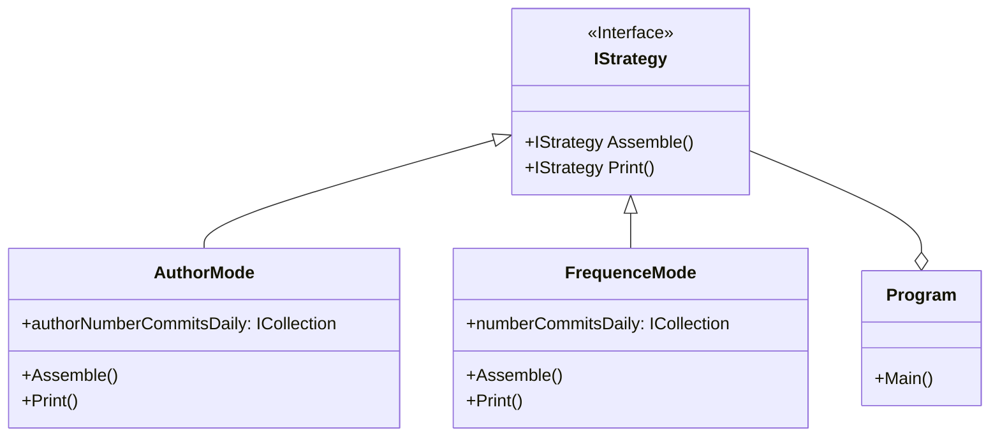

# Git Insight

# Proposed System

## Functional requirements

**User requirements:**
* The system must be able to run from the command line.
* The system must accept a path to a Git repository that resides in a local directory as an argument when running the program.
* The program must be able to display all commits with respective author names and author dates for a given Git repository.
* The system must be able to run in two modes called commit frequency mode and commit author mode, which the user must give as an argument when running the program. If the the user gives 0 as argument the program must run in commit frequency mode. If the user gives 1 as argument the program must run in commit author mode.
* The commit frequency mode must produce a textual output on stdout that lists the number of commits per day.
* The commit author mode must produce a textual output on stdout that lists the number of commits per day per author.

## Nonfunctional Requirements

**Usability:**
* Users should always be able to choose which mode to run the program in by giving an argument when starting the program.

**Reliability:**
* Users should be able to successfully run the program in commit frequency mode 99% of the time without failure.
* Users should be able to successfully run the program in commit author mode 99% of the time without failure.

**Performance:**
* The system should be able to produce a textual output on stdout when running commit frequency mode within 3 seconds.
* The system should be able to produce a textual output on stdout when running commit author mode within 3 seconds.

**Supportability:**
* The developers should follow the SOLID principles.
* The developers should follow the test driven development approach.
* The structure of the system should follow the rules of clean architecture.

**Implementation:**
* The system should be using ASP.NET Core framework.

**Legal:**
* The project should be using the MIT license.

## Design Decisions
We have decided to use the Strategy Design Pattern for the different modes GitInsight needs to run. That way we will easily be able to add more modes.
Using the Repository Pattern.
We are avoiding interactive input/output.

**Maybe**
Might use CommandLineParser if more command arguments become necessary.

## System Models

### Scenarios

### Use Cases

| Use case name        |                         |
|----------------------|-------------------------|
| Participating actors | Initiated by user       |
| Flow of events       | 1.                      |
|                      | 2.                      |
|                      | 3.                      |
|                      | 4.                      |
|                      | 5.                      |
|                      | 6.                      |
| Entry conditions     | -                       |
|                      | -                       |
|                      | -                       |
| Exit conditions      | -                       |
|                      | -                       |
|                      | -                       |
| Quality requirements | -                       |
|                      | -                       |
|                      | -                       |
|                      | -                       |

### Class Diagrams

## Dynamic Models

### Sequence diagram

### Collaboration diagram

### Statechart diagrams
